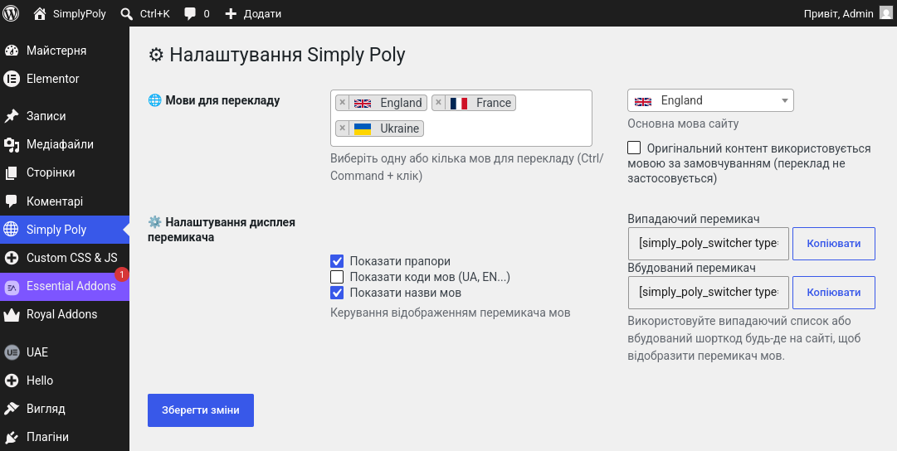
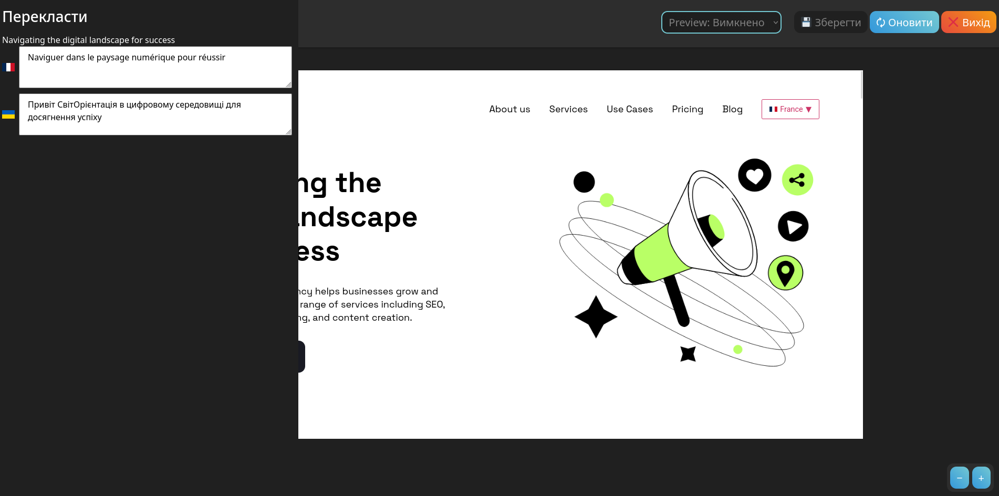
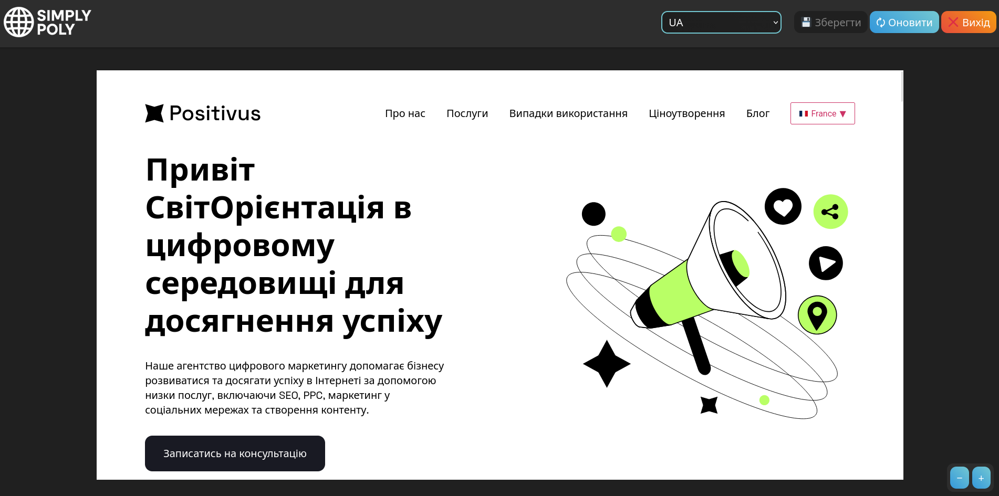
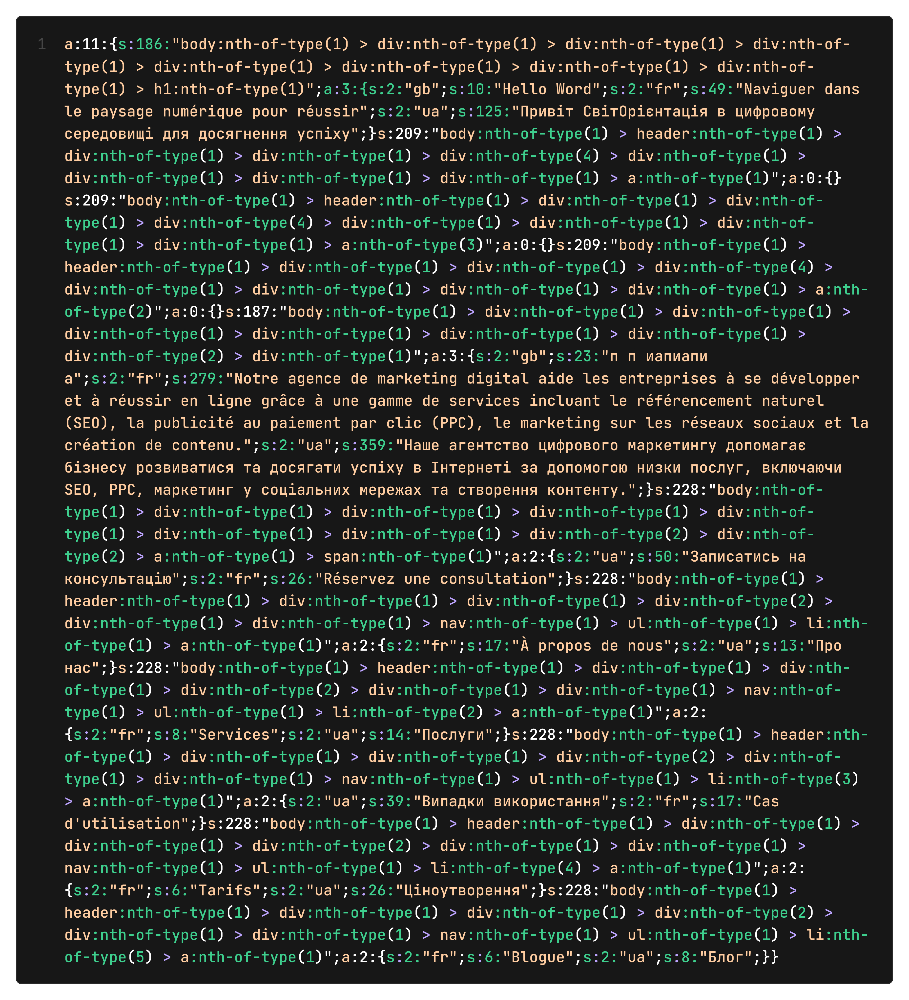

<p align="center">
  
</p>

<h1 align="center">Simply Poly – Visual Multilingual Plugin for WordPress</h1>

## Description

**EN:**

Simply Poly is a lightweight multilingual plugin for WordPress that allows website owners to create and manage translations directly from a visual editor. Unlike traditional multilingual plugins that require duplicate pages or complex translation interfaces, Simply Poly stores translations inside a single page and applies them dynamically depending on the selected language.

The project was developed as a bachelor's qualification work and demonstrates the implementation of a custom multilingual system using WordPress APIs, PHP, JavaScript, jQuery, and Docker.

**Main features:**

1. **Visual Translation Builder** – select text elements directly on the page and translate them through a convenient side panel.
2. **Single Page Translation Storage** – all translations are stored inside page metadata without creating duplicate pages.
3. **Live Preview System** – instantly preview translations before saving changes.
4. **Language Switcher** – built-in dropdown and inline language switchers.
5. **Flexible Display Settings** – support for language flags, codes, and names.
6. **WordPress Integration** – seamless integration with the administration panel and editor.
7. **Lightweight Architecture** – minimal impact on website performance.
8. **Open Source Solution** – designed as a free alternative to commercial multilingual plugins.

---

**UA:**

Simply Poly — це легкий мультимовний плагін для WordPress, який дозволяє створювати та керувати перекладами безпосередньо через візуальний редактор. На відміну від більшості традиційних мультимовних рішень, плагін не створює дублікати сторінок, а зберігає всі переклади в межах однієї сторінки та підставляє їх відповідно до обраної мови.

Проєкт був розроблений у рамках бакалаврської кваліфікаційної роботи та демонструє реалізацію власної системи мультимовності з використанням WordPress API, PHP, JavaScript, jQuery та Docker.

**Основні можливості:**

1. **Візуальний редактор перекладів** — можливість обирати текстові елементи безпосередньо на сторінці та редагувати переклади через бічну панель.
2. **Зберігання перекладів в одній сторінці** — переклади зберігаються у метаданих WordPress без створення копій сторінок.
3. **Попередній перегляд у реальному часі** — перегляд результату до збереження змін.
4. **Перемикач мов** — підтримка випадаючого та лінійного режимів відображення мов.
5. **Гнучке налаштування інтерфейсу** — відображення прапорів, кодів та назв мов.
6. **Інтеграція з WordPress** — підтримка адміністративної панелі та стандартних механізмів CMS.
7. **Легка архітектура** — мінімальне навантаження на сайт.
8. **Безкоштовне рішення** — альтернатива популярним комерційним мультимовним плагінам.

#

## Screenshots

<p align="center">
  
  
</p>

<p align="center">
  
  
</p>

#

## Technologies Used

### EN

* **WordPress Plugin Development**
* **PHP 8**
* **JavaScript (ES6 Modules)**
* **jQuery**
* **HTML5**
* **CSS3**
* **WordPress Hooks API**
* **WordPress Metadata API**
* **AJAX communication**
* **Visual Translation Builder**
* **Live Preview System**
* **Docker-based development environment**
* **Object-Oriented Programming (OOP)**
* **MVC-inspired project structure**

### UA

* Розробка плагінів для **WordPress**
* **PHP 8**
* **JavaScript (ES6 Modules)**
* **jQuery**
* **HTML5**
* **CSS3**
* **WordPress Hooks API**
* **WordPress Metadata API**
* **AJAX-взаємодія**
* Візуальний редактор перекладів
* Система попереднього перегляду перекладів
* Середовище розробки на базі **Docker**
* Об'єктно-орієнтоване програмування (ООП)
* Архітектура проєкту на основі підходу MVC

#

## Project Structure

```text
SimplyPoly/
├── simply-poly/
│   │
│   ├── assets/
│   │   ├── css/
│   │   ├── img/
│   │   └── js/
│   │
│   ├── includes/
│   │   ├── controllers/
│   │   ├── interfaces/
│   │   ├── models/
│   │   └── views/
│   │
│   ├── languages/
│   │
│   ├── .env
│   ├── all-languages.json
│   ├── helper.php
│   └── simply-poly.php
│
├── screenshots/
│
├── wordpress_data/
│
└── mysql_data/
```

#

## Docker Setup

```bash
docker compose up -d
```

After starting the containers, WordPress will be available in your browser.

The Docker environment includes:

* WordPress
* PHP
* MySQL
* phpMyAdmin (optional)

#

## Installation

1. Download the plugin.
2. Copy it into:

```text
wp-content/plugins/
```

3. Activate **Simply Poly** in the WordPress administration panel.
4. Open **Simply Poly Settings**.
5. Configure available languages and the default language.
6. Start translating pages using the visual editor.

#

## License

```text
© 2026, CoolOtaku

Released under the GNU General Public License (GPL).
```
